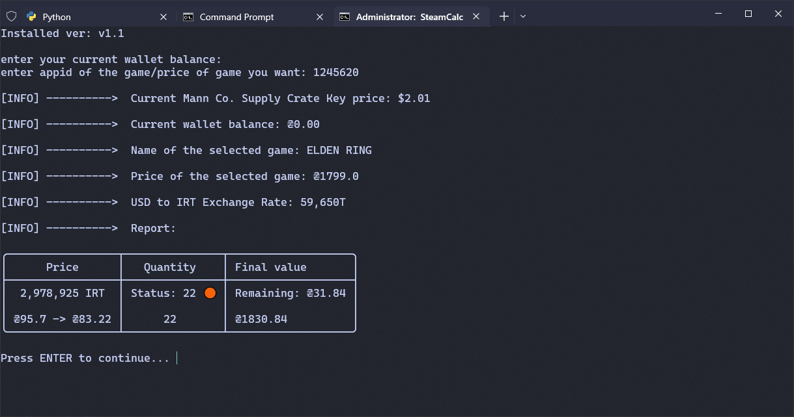

# Steam Calculator (Based on market items) CLI

This program calculates the price of game/bundle/package on Steam based on the sale of an item in the market.\
Then, according to dollar exchange rate, calculates final Toman price.

> Program changed from Turkish Lira to MENA USD

## Features
- Can get the final price of the product in Steam only with appid
- Considers current balance of your account in calculations
- Calculates steam fee/seller fee for items in market
- Finds the highest buy order available at the moment
- Declares account balance after selling items and buying the desired product
- Informs how many items you have available for sale

## Configuration (config.json)

### Item
You can enter desired market item (like CSGO case or TF2 key) that you want the final price to be calculated by. this part includes `app_id` and `name_id` (and item_name, which is completely optional), which are set to `440`(Team Fortress 2) and `1`(Mann Co. Supply Crate Key) by default.

### Currencies
This section is for specifying the character as the symbol of the origin and destination currency ($ --> IRT).

### Params
To accessing player item data and checking the availability of the item specified in it, this section needs to be filled. `steam_id` is your `steamID64` and `steam_key` is your `Steam Web API Key`.

### Src
It's currency exchange-rate api. (Can't be changed)

## How to use
1. Download the latest [release](https://github.com/amoAR/SteamCalculator/releases).
2. Fill the configuration file (Config.json) according to the above description.
3. Install python non built-in modules ([requests](https://pypi.org/project/requests/), [js2py](https://pypi.org/project/Js2Py/), [tabulate](https://pypi.org/project/tabulate/)).
4. Run script by run.cmd file.

> Since Steam has increased the request rate limit, it's best to wait a bit after each request and run again to avoid HTTP 429.

## Screenshots

## Credits

- [Steam Market Fees Calculator](https://github.com/how2steam/steam-fees-graph-calculator)
- [Steamworks](https://partner.steamgames.com)
- [PriceDB](https://github.com/margani/pricedb)